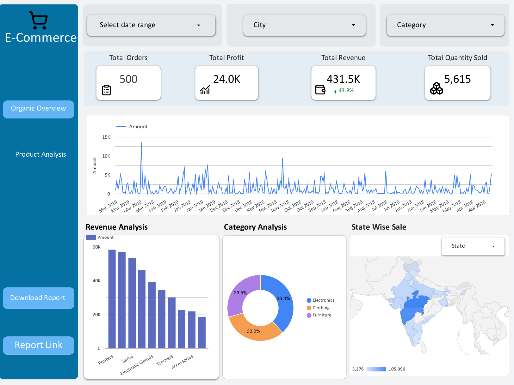
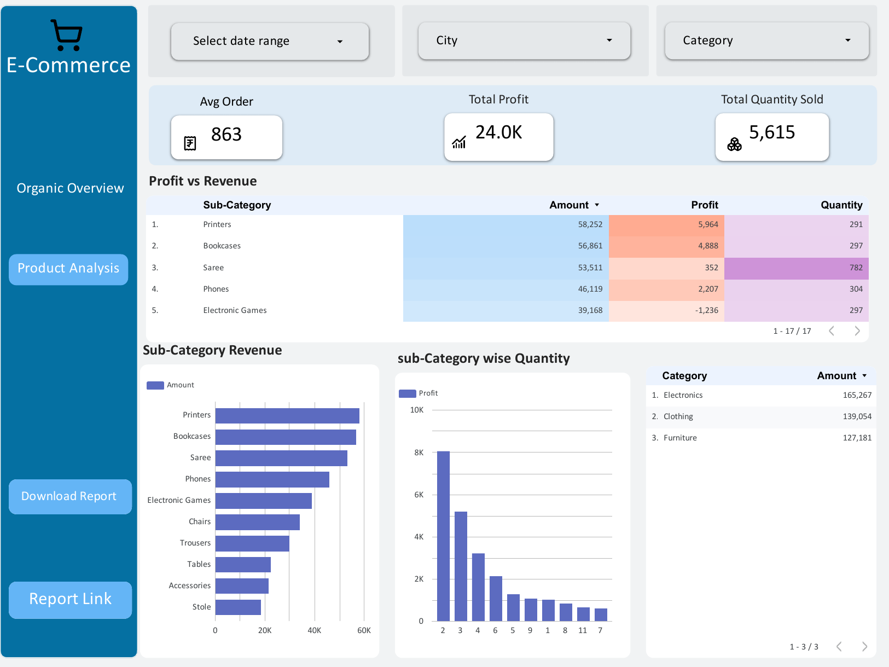

# E-Commerce Sales Dashboard (Looker Studio)
An interactive sales dashboard analyzing 500 orders, ₹431.5K revenue, and ₹24K profit across 3 categories and 17 sub-categories. Built as a self-learning project to practice Looker Studio using a public e-commerce dataset.

## Features
- Filters for date range, city, and category
- KPIs: total orders, revenue, profit, quantity sold, and average order value
- Revenue trend over time, category split, and state-wise sales map
- Sub-category analysis comparing revenue, profit, and quantity

## Key Insights
- Electronics generated the highest revenue (~38%), followed by Clothing and Furniture.
- Saree had the highest quantity sold (782) but a very low profit (352).
- Electronic Games had high revenue but negative profit (-1,236).

## Tools Used
Looker Studio

## Dashboard Screenshots

**Overview page**

**Product Analysis page**

